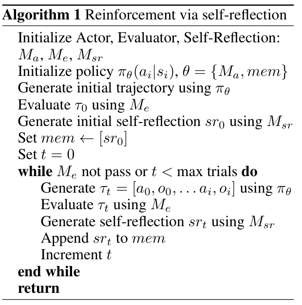
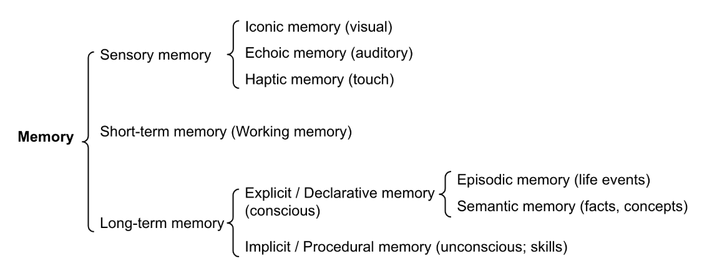

# AI Agents  

  

The agent learns to call external APIs for extra information that is missing from the model weights (often hard to change after pre-training), including current information, code execution capability, access to proprietary information sources and more.

# Planning  

The first component is planning: an agent needs to know what they are and plan ahead. 
Task decomposition 
- Chain of thought has became a standard prompting technique for enhancing model performance.  The model is instructed to “think step by step” to utilize more test-time computation to decompose hard tasks into smaller and simpler steps. CoT transforms big tasks into multiple manageable tasks and shed lights into an interpretation of the model’s thinking process.
# Insights on CoT  
NLP: how to program the computer to elaborate and analyze a huge quantity of data in natural language. The objective is to make a machine able to understand documents content and their contextual shades.
Scaling up the size of language models has been shown to confer a range of benefits, such as improved performance and sample efficiency. However, scaling up model size alone has not proved sufficient for achieving high performance on challenging tasks such as arithmetic, commonsense, and symbolic reasoning. CoT comes from two main ideas: 
- reasoning can benefit from generating natural language rationales that lead to the final answer;
- LLMs offer the exciting prospect of in-context few-shot learning via prompting.

```
Few-shot prompting is a technique in which an AI model is given a few examples of a task to learn from before generating a response, using those examples to improve its performance on similar tasks.  
```  
Specifically, to perform few-shot prompting for reasoning tasks a prompt that consists of triples: <input, chain of thought, output> can be used. A chain of thought is a series of intermediate natural language reasoning steps that lead to the final output.  
Chain-of-thought prompting has several attractive properties as an approach for facilitating reasoning in language models.
 1. First, chain of thought, in principle, allows models to decompose multi-step problems into
 intermediate steps, which means that additional computation can be allocated to problems
 that require more reasoning steps.
 2. Second, a chain of thought provides an interpretable window into the behavior of the model,
 suggesting how it might have arrived at a particular answer and providing opportunities
 to debug where the reasoning path went wrong (although fully characterizing a model’s
 computations that support an answer remains an open question).
 3. Third, chain-of-thought reasoning can be used for tasks such as math word problems,
 commonsense reasoning, and symbolic manipulation, and is potentially applicable (at least
 in principle) to any task that humans can solve via language.
 4. Finally, chain-of-thought reasoning can be readily elicited in sufficiently large off-the-shelf
 language models simply by including examples of chain of thought sequences into the
 exemplars of few-shot prompting.

- Tree of thoughts: extends CoT by exploring multiple reasoning possibilities at each step. It first decomposes the problem into multiple thought steps and generates multiple thoughts per step, creating a tree structure. The search process can be BFS (breadth-first search) or DFS (depth-first search) with each state evaluated by a classifier (via a prompt) or majority vote.
# Insights on ToT  
Research on human problem-solving suggests that people search through a combinatorial problem
space– a tree where the nodes represent partial solutions, and the branches correspond to operators
that modify them [21, 22]. Which branch to take is determined by heuristics that help to navigate the
problem-space and guide the problem-solver towards a solution.  
ToT frames any problem as a search over a tree, where each node is a state s = [x,z1···i] representing a partial solution with the input and the sequence of thoughts so far.  
A specific instantiation of ToT involves answering four questions:
 1. How to decompose the intermediate process into thought steps; 
 2. How to generate potential thoughts from each state; 
 3. How to heuristically evaluate states; 
 4. What search algorithm to use.

There are examples with BFS to expand a node in breadth evaluating different possibilities and DFS, that keeps expanding a node till a limit.

# Problems with LLMs  and LLM+P:
Given how LLMs are designed and trained, this phenomenon should come as no surprise. They are not specifically built to demonstrate understanding. They are trained  to generate sequences of words that might be plausible to a human given a prior context.  
Se un modello ha visto spesso relazioni causa-effetto, catene di ragionamenti, regole matematiche, allora generare una risposta logica sarà la soluzione più coerente con il contesto.  
LLM+P, when posed a natural language description of a planning problem, the LLM:
 1. outputs a problem description suitable as input to a  general-purpose planner;
 2. solves the problem using the general-purpose planner;
 3. converts the output of the planner back to natural language (or connects to action executors of a robot).

# ReAct  

Consider a general setup of an agent interacting with an environment for task solving. At timestep t, an agent receives an observation ot  from the environment and takes an action at following some policy p(at|ct), where ct = (o1,a1,....,ot-1,at-1,ot) is the context to the agent. Learning a policy is challenging when the mapping ct->at is highly implicit and requires extensive computation.
The idea of ReAct is simple: we augment the agent’s action space to A = A U L, where L is the space of language. An action **at** belonging to L in the language space, which we will refer to as a thought or a reasoning trace, does not affect the external environment, thus leading to no observation feedback.
Instead, a thought **at** aims to compose useful information by reasoning over the current context ct,
and update the context ct+1 = (ct,**at**) to support future reasoning or acting. However, as the language space L is unlimited, learning in this augmented action space is difficult and requires strong language priors.    
Few-shot still used to give to the LLM a few in-context examples of how ReAct process has to be developed. By interacting with Wikipedia, the model is able to retrieve information to support reasoning, while also using its internal knowledge.  
the problem solving process demonstrated by ReAct is more factual and grounded, whereas CoT is more accurate in formulating reasoning structure but can easily suffer from hallucinated facts or thoughts.  
ReAct succesfully reduces the amount of times the reasoning process gets hallucinated, from 14% (CoT) to 6%, however while interleaving reasoning, action and observation steps improves ReAct’s groundedness and trustworthiness, such a structural constraint also reduces its flexibility in formulating reasoning steps, leading to more reasoning error rate than CoT. There is one frequent error pattern specific to ReAct, in which the model repetitively generates the previous thoughts and actions, and we categorize it as part of “reasoning error” as the model fails to reason about what the proper next action to take and jump out of the loop.  
The solution is to use **ReAct + CoT-SC (self-consistency)** setting some criteria (e.g.: if the majority voting is lower than 50%, switch to ReAct).  


# Reflexion  
Reflexion is a framework to reinforce language agents not by updating weights, but instead through linguistic feedback. Concretely, Reflexion agents verbally reflect on task feedback signals, then maintain their own reflective text in an episodic memory buffer to induce better decision-making in subsequent trials.  
Reflexion converts binary or scalar feedback from the environment into verbal feedback in the form of a textual summary, which is then added as additional context for the LLM agent in the next episode.  
Generating useful reflective feedback is challenging since it requires a good understanding of where the model made mistakes (i.e. the credit assignment problem) as well as the ability to generate a summary containing actionable insights for improvement.  
**How it works**: there are three distinct models: anActor, denoted as Ma,which generates text and actions;anEvaluator model, represented by Me, that scores the outputs produced by Ma and a Self-Reflection model, denoted as Msr, which generates verbal reinforcement cues to assist the Actor in self-improvement.  


  

**Memory**: Core components of the Reflexion process are the notion of short-term and long-term memory. At inference time, the Actor conditions its decisions on short and long-term memory, similar to the way that humans remember fine-grain recent details while also recalling distilled important experiences from long-term memory. In the RL setup, the trajectory history serves as the short-term memory while outputs from the Self-Reflection model are stored in long-term memory. These two memory components work together to provide context that is specific but also influenced by lessons learned over several trials. Mem is usually bounded by a maximum number of stored experiences, Ω (usually set to 1-3) to adhere to max context LLM limitations. <-- **Here they bound the LTM. We can think of doing something similar or why not requiring the LLM to synthesize in a limited number of tokens (let's say words or lines) the context up to this point->prompt engineering to improve the quality of the resume got by GPT.**  
The heuristic function determines when the trajectory is inefficient or contains hallucination and should be stopped. Inefficient planning refers to trajectories that take too long without success. Hallucination is defined as encountering a sequence of consecutive identical actions that lead to the same observation in the environment. Self-reflection is created by showing two-shot examples to LLM and each example is a pair of (failed trajectory, ideal reflection for guiding future changes in the plan). Then reflections are added into the agent’s working memory, up to three, to be used as context for querying LLM.


# Memory component: different types of memories  

1. Sensory Memory: This is the earliest stage of memory, providing the ability to retain impressions of sensory information (visual, auditory, etc) after the original stimuli have ended. Sensory memory typically only lasts for up to a few seconds. Subcategories include iconic memory (visual), echoic memory (auditory), and haptic memory (touch).

2. Short-Term Memory (STM) or Working Memory: It stores information that we are currently aware of and needed to carry out complex cognitive tasks such as learning and reasoning. Short-term memory is believed to have the capacity of about 7 items (Miller 1956) and lasts for 20-30 seconds.

3. Long-Term Memory (LTM): Long-term memory can store information for a remarkably long time, ranging from a few days to decades, with an essentially unlimited storage capacity. There are two subtypes of LTM: 
   - Explicit / declarative memory: This is memory of facts and events, and refers to those memories that can be consciously recalled, including episodic memory (events and experiences) and semantic memory (facts and concepts).
   - Implicit / procedural memory: This type of memory is unconscious and involves skills and routines that are performed automatically, like riding a bike or typing on a keyboard.


  

We can roughly consider the following mappings:

- Sensory memory as learning embedding representations for raw inputs, including text, image or other modalities;
- Short-term memory as in-context learning. It is short and finite, as it is restricted by the finite context window length of Transformer.
- Long-term memory as the external vector store that the agent can attend to at query time, accessible via fast retrieval: use APIs or RAG to access it.  


# MIPS  
The external memory can alleviate the restriction of finite attention span. A standard practice is to save the embedding representation of information into a vector store database that can support fast maximum inner-product search (MIPS).
Maximum inner-product search (MIPS) is a search problem, with a corresponding class of search algorithms which attempt to maximise the inner product between a query and the data items to be retrieved. MIPS algorithms are used in a wide variety of big data applications, including recommendation algorithms and machine learning. To optimize the retrieval speed, the common choice is the approximate nearest neighbors (ANN)​ algorithm to return approximately top k nearest neighbors to trade off a little accuracy lost for a huge speedup. A couple common choices of ANN algorithms for fast MIPS:
- LSH;
- ANNOY;
- HNSW;
- FAISS;
- scaNN. 

