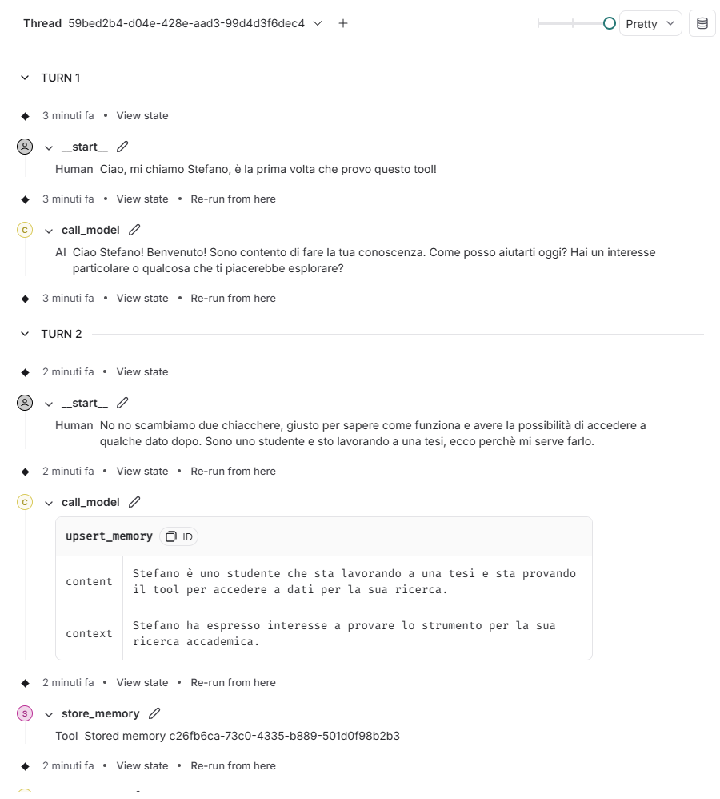
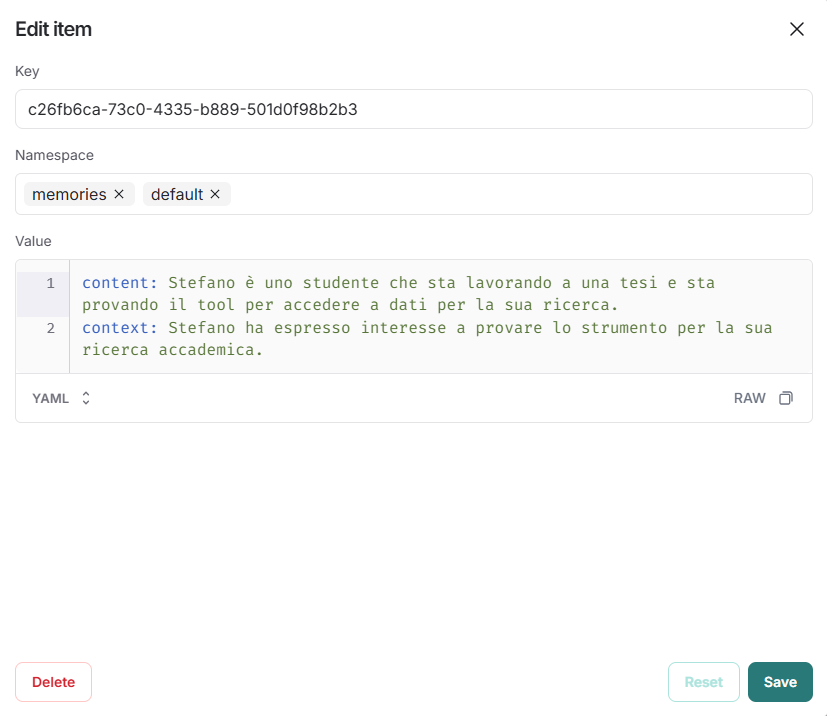

# LLM_Agent_Cybersecurity_Forensic
AI agent leveraging on LLM models in order to perform cybersecurity forensic.

Using [templates](https://langchain-ai.github.io/langgraph/concepts/template_applications/) (use the command: langgraph new --template [template_name]-[language(e.g.:python)]) we can define agents with different responsibilities. Configure the .env file and then command: langgraph dev


With [multi-agent supervision](https://langchain-ai.github.io/langgraph/tutorials/multi_agent/agent_supervisor/) provided by LangChain, we can create a Multi-agent systems composed by 3 main components:
1. Memory Agent (Orchestrator) -> ReAct agent that coordinates everything and mantain the context;
2. Retrieval Agent -> search for more information online;


The orchestrator is prompted as a supervisor tasked with managing conversation between a list of workers. Then, given a request, it responds with the worker to act next passing what is necessary for that worker. Each worker can interact with different tools, allowing for better modularization and separation of concerns.  

How to manage the context?  
1. Immediate Context: Use a sliding window for the most recent and relevant conversation bits; 
2. Deep Memory: Store older context as vectors to retrieve only what’s necessary. 


With LangChain, we have the possibility to limit the (long term/scratchpad) memory buffer based on a predefined number of tokens (let's say, 4000):

```python
from langchain.memory import ConversationTokenBufferMemory
from langchain.chat_models import ChatOpenAI

# limit the memory to 4000 tokes
memory = ConversationTokenBufferMemory(llm=ChatOpenAI(model_name="gpt-4-turbo"), max_token_limit=4000)

# Save info, only the last 4000 tokens will be mantained
memory.save_context(...info)

# Recover the context
print(memory.load_memory_variables({}))
```

At each steps, append both the prompt and the observation obtained to the Scratchpad. At each new step, if the number of tokens (counted with tiktokens) is equal to the maximum allowed for the Scratchpad, retrieve from the db the informations that are more 'aligned' with the elements appended in the previous iteration.   

How to store in the db for future retrieval? We can keep track of what is dynamically removed from the sliding context window and save what would be lost in a database. Then, using the strategy explained before, we try to retrieve what is more relevant. A summary of older information and all details for more recent information could be more beneficial than ReAct + summary-> In forensic it could be better to mantain every detail of the last 2/3 steps and have a general idea of what has been done before. If you summarize everything, the risk is to lose relevant details of the previous steps.


# AGENT TESTS
**Test one the memory agent**



Question: why is it creating that context for the second answer and not for the first one? 
In the first question I'm telling him my name, then I give some other information. When storing into memory (second step), it remembers my name and additional informations. Why?

**What does it keep inside?**  

  


**Web search**  

Web search agents is implemented in LangGraph's tutorial using Tavily, which is free for 1000 calls and then requires an upgrade. Thus, we can't use this type of tool, even if it would be probably more precise. [Here](https://github.com/menonpg/agentic_search_openai_langgraph) there's a repo implementing two strategies for web search:
1. Duckduckgo, already used in the previous research (free);
2. Tavily, easy but needs to be payed.

**Memory saver**  

MemorySaver stores information on RAM. It stores something like: 
[
    {"role": "user", "content": "Ciao, cosa sai su LangGraph?"},
    {"role": "assistant", "content": "LangGraph è un framework per creare agenti AI."},
    {"role": "user", "content": "Come lo posso usare per la memoria?"}
]
and associates it to a thread_id. When the conversation gets back from a previous node, it passes to the model the entire list of prompts, in a way that it is simulating the fact that it remembers information. Obviously, the context window is a problem: if the number of prompts is too high, the number of tokens offered by the model are not enough.  


In a paper called MemGPT ([MemGPT](https://arxiv.org/abs/2310.08560)) the problem is solved introducing memory handling as it is done in modern operating systems, with a storage that manages past informations through pagination and retrieval to update the actual context of the LLM to perform inference. This is automatically managed by the LLM that knows functions to be called in order to move data to the storage and to access it. The code of the paper is available [here](https://github.com/letta-ai/letta). In the meanwhile, MemGPT became a software ([Letta](https://docs.letta.com/api-reference/overview), open source but it requires a key for a certain usage, not a viable option), so the code is quite huge to be examined and understood. However, on LangGraph there's an implementation that is inspired by MemGPT [here](https://python.langchain.com/docs/versions/migrating_memory/long_term_memory_agent/).

